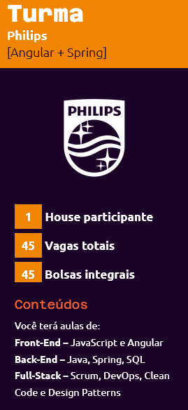

# DEVin[Philips]
<strong>O DEVinHouse é um programa de formação de talentos, com uma proposta inovadora, ágil e mão na massa realizado em parceria com empresas que desejam captar e formar talentos.</strong>

## <strong>Experiência online</strong>

### Viva o dia a dia de um desenvolvedor. Utilizamos as cerimônias do SCRUM para que você se organize com as atividades do curso, além de 3 horas de conteúdo ao vivo e interativo com o docente e a turma. Agendas práticas com as Houses

### No decorrer do curso, você terá vivências com a empresa para interagir com os profissionais, compartilhar experiências e aprender sobre temas e ferramentas específicas do mercado. Exercícios e projetos para o portfólio

### Semalmente, você será desafiado a concluir um bloco de exercícios de fixação que poderão gerar projetos interessantes para rechear o seu portfólio. Além disso, você também terá projetos avaliativos, onde você irá resolver problemas reais de mercado. Dedicação

### DEVinHouse tem duração de 9 meses: 3 meses por módulo, com intervalo de uma semana entre cada um. Você precisará dedicar aproximadamente 25 horas por semana entre aulas, atividades e vivências.

 Este repositório contém os exercícios do curso <strong>DEVinHouse</strong>  edição <strong>Philips</strong>.

## Módulo: 1

## Semana: 01

## Semana: 02